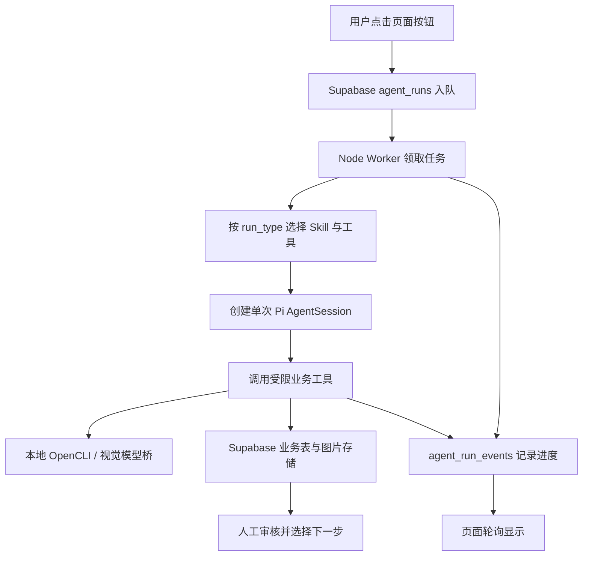
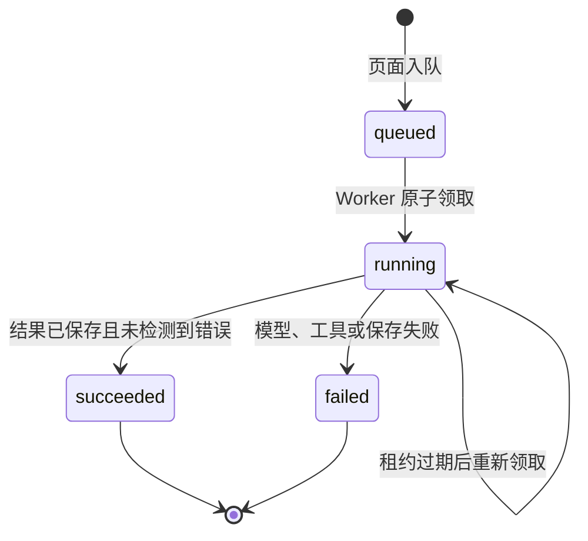

# 从 LLM 调用到 Pi Agent：Creator Ops Studio 的架构演进

记录日期：2026 年 9 月 8 日。本文依据当前代码、数据库迁移、已有验证记录及真实失败案例整理。本轮只做梳理，不重新运行业务测试。文中选型理由是结合当前需求与实现的技术解释，不代表曾做过完整的框架横向实验。

这个项目的目标，是把漫画内容运营中分散的调研、素材整理、选题策划和文案生产组织成一个可持续使用的工作台。第一阶段解决了“模型能不能帮助生成内容”，这一轮开始解决“模型如何在真实业务里领取任务、使用工具、保存结果，以及让人知道它做到了哪一步”。

目前的阶段结论是：六类页面任务已经接入 Pi，后台执行与业务数据完成了初步分离；但真实业务验收和失败反馈收尾尚未完成。对话式总控暂缓，优先把当前页面驱动的流程做好。

## 1. 起点：让 LLM 成为内容工作台中的一个能力

第一阶段采取了直接、容易落地的路径：页面收集输入，程序读取资料、拼接提示词、调用模型，再解析输出并保存。浏览器采集、数据库读写和执行顺序主要由业务代码决定，LLM 负责其中的文本生成或图片理解。

例如生成 Brief，程序先拿到漫画档案和参考笔记，把材料交给模型，要求它返回策划字段。对于输入明确、输出明确的一次性生成，这种方式简单、便宜，也便于控制请求次数。

随着工作台扩展，问题逐渐从“生成一段内容”变成“完成一个有前置条件和后续影响的业务步骤”。生成草稿之前，要检查 Brief 是否通过、素材是否可用、顺序是否确定；采集笔记要读取详情、下载图片、逐张分析、存储并保留来源。与此同时，页面刷新、模型报错、网络中断和部分写入都开始影响操作体验。

这时继续在每个按钮里分别堆叠逻辑，会产生三个维护问题：执行规则分散，任务过程难以统一追踪，新增流程需要重复实现状态和错误处理。项目虽然已有 Skill 文档，但仅有文档并不意味着页面执行时真的使用了它们。

## 2. 为什么升级：让一次操作成为有边界的任务

本轮改造的目标，是将页面上的 AI 操作统一表达为任务：任务有明确对象、输入、可用工具、完成条件和执行记录。Pi 负责在允许范围内理解上下文、生成内容并调用工具；程序继续负责数据校验、访问控制和写入。

这里需要区分两种收益。后台执行、持久化队列和进度记录是 Worker 与数据库带来的工程收益，即使不使用 Agent 也可以实现。Pi 带来的收益，是复用模型会话和工具调用循环，并把业务 Skill 纳入执行上下文。这两部分组合起来，才构成当前方案。

整个内容链仍由人推进：

> 漫画候选 → 人工保留 → 官方档案 → 参考调研 → 人工导入与筛选 → 笔记及素材采集 → 选题 → Brief → 人工审核与选图 → 草稿 → 人工编辑与发布。

当前每次只执行其中一个步骤。一次“采集素材”不授权自动生成选题，一次“生成 Brief”也不会顺带通过审核。

## 3. 架构选型：保留已有基础，补上执行层

| 层次 | 当前选择 | 选择理由与代价 |
|---|---|---|
| 页面 | React、TypeScript、Vite | 延续已有工作台和交互；目前本地桥挂在 Vite 开发服务中，尚不是独立生产后端 |
| 业务存储 | Supabase PostgreSQL | 已有账号、内容、关联关系和 RLS，可在同一数据库里增加任务记录 |
| 图片存储 | Supabase 私有 Storage | 图片文件与结构化元数据分开存放，保留来源和存储路径 |
| 任务队列 | PostgreSQL 表与领取 RPC | 适合当前本地、低并发规模，避免额外引入 Redis 或消息系统；需要自己完善重试、租约和监控 |
| 执行宿主 | Node Worker | 与 TypeScript 项目及 Pi SDK 衔接方便，能在本机访问浏览器桥，并持有服务端凭证 |
| Agent 运行时 | Pi SDK | 提供模型会话、工具调用和 Skill 加载，可按单个任务限制能力 |
| 平台访问 | OpenCLI 与本地已登录 Chrome | 复用现有采集能力；受登录状态、页面变化和本机服务可用性影响 |
| 模型能力 | Pi 模型与独立视觉模型桥 | 内容决策与图片分析可分别配置；也增加了需要维护的外部依赖 |

没有引入复杂的分布式工作流平台，是因为当前首先服务本地人工操作、任务量有限。将来如果需要多机器执行、高并发、长时间任务和可靠补偿，再评估专用队列或工作流引擎更合适。现有选型是阶段性取舍，不代表数据库队列能无成本覆盖所有规模。

## 4. 为什么选择 Pi

当前需要一个能够嵌入 Node 程序、接受自定义工具、加载项目 Skill，并在完成单次任务后释放的运行时。Pi 的 `createAgentSession`、`defineTool`、`DefaultResourceLoader` 和 `SessionManager` 满足这些接入点，因此无需自行实现完整的模型消息循环和工具调度协议。

另一个匹配点是项目已有 Skill 组织方式。每个 Skill 描述输入条件、证据要求、输出与停止条件，可以服务页面后台任务，也能为未来直接对话提供业务规则基础。但两种入口的配置不同，不能假设它们自动拥有完全一致的上下文。

Pi 本身也有边界：它不提供本项目的账号隔离、内容状态机、队列服务、浏览器业务适配和人工审批。这些仍需要我们实现。选择 Pi 的理由是接口适配当前需求；目前没有性能或成功率基准，不能据此声称它比其他框架更快、更稳或成本更低。

## 5. 为什么采用 Worker → Pi

Worker 负责领取任务、准备上下文、提供工具、管理会话和记录结果。Pi 负责在这些条件下推理和选择工具调用。Worker 是 Pi 的宿主，一个任务通常创建一个内存会话，结束后调用 `dispose()`。当前单个 Worker 循环一次处理一个任务，没有多 Agent 协作或跨任务持续对话。

这样设计有三个直接作用。首先，长任务的执行归后台进程管理，页面承担发起和展示。其次，Supabase service-role 凭证留在 Worker，模型通过受限工具访问业务数据。最后，一次任务可以从排队追踪到结束，而不必从聊天文本里推测有没有成功。

持久化任务并不等于会话断点恢复。页面刷新不会删除队列记录，但前端自动重新挂接所有任务仍不完整；Worker 重启后也不能从 Pi 的某一条历史工具消息继续，因为会话使用内存存储。当前恢复方式主要是租约过期后重新领取，再从工作流起点执行。

## 6. 我们对 Pi 做了哪些改造

本轮通过 `@earendil-works/pi-coding-agent` 0.85.1 接入，没有在本项目中维护 Pi 核心源码分叉。主要工作发生在配置、宿主和业务工具层。

### 6.1 两套入口配置

直接 Pi 对话/TUI 使用 `.pi/settings.json`：默认 Provider 为 `openai-codex`，模型为 `gpt-5.6-terra`，思考等级为 `medium`，通过 `../skills` 加载项目 Skill，并启用 Skill 命令。`AGENTS.md` 与 `.pi/APPEND_SYSTEM.md` 描述项目流程和操作边界。

后台 Worker 则显式创建会话，模型读取 `PI_RESEARCH_MODEL`，默认值同上，思考等级在代码中指定为 `medium`。这个环境变量虽然名称仍带 `RESEARCH`，实际已被六类任务共用。仅修改 TUI 的默认模型，不保证后台会跟着变化。

Worker 禁用全局扩展、自动 Skill 发现和默认上下文文件加载，再注入 `agent/RUNTIME.md`、当前 Skill 和专属工具；调研还加载 `agent/runtimes/research.md`。因此后台并非自动读取整套 TUI 规则。保持两种入口规则一致，是后续维护责任。

### 6.2 六种任务、八个 Skill

| 页面任务 / run_type | 使用的 Skill | 当前执行边界 |
|---|---|---|
| 官方档案 / `comic_profile_enrichment` | `kuaikan-comic-profile-enrichment` | 读取已保留漫画、获取官方资料、保存档案和封面 |
| 参考调研 / `research_discovery` | `xiaohongshu-comic-reference-discovery` | 读取上下文、搜索、保存候选快照，等待人工导入 |
| 笔记采集 / `note_capture` | `xiaohongshu-comic-note-capture`、`xiaohongshu-comic-asset-ingestion` | 采集一篇已保留笔记，分析图片并入库 |
| 选题 / `topic_synthesis` | `comic-topic-synthesis` | 从同漫画的 1–4 条已保留、已完整采集参考生成候选选题 |
| Brief / `brief_generation` | `comic-brief-generation` | 生成候选 Brief，保留证据快照，等待人工审核 |
| 草稿 / `draft_generation` | `comic-draft-generation` | 使用已通过 Brief 和已选可用素材，保存新草稿版本 |

第八个 Skill `kuaikan-comic-discovery` 已存在，但没有独立注册成上述后台任务。不能把“八个 Skill 可发现”表述为“八个后台流程全部接通”。

### 6.3 用代码约束模型输出

调研中模型只能选择本次搜索结果的编号，原始 URL 由宿主保留；生成前校验用户、账号、漫画、参考完整性和审核条件；写入时检查必需字段、限制长度并保存证据。生成 Brief 的状态固定为 `candidate`，草稿写入 `review_status = draft`。

这些约束有一部分是工具代码的硬校验，有一部分仍是 Skill 和提示词规则。提示词不是数据库权限机制，也不能保证模型永远遵守流程。当前部分输出工具仍接受宽泛对象并在运行时检查，校验强度还有完善空间。

采集流程尤其体现了混合架构：Pi 先读取笔记上下文，再调用 `capture_and_ingest_note`；工具内部的下载、逐图视觉分析、上传和写库，仍由固定程序顺序执行。并不是所有步骤都交给模型自由规划。

## 7. 数据库如何演进

数据库沿用关系型业务模型：用户拥有运营账号，账号下组织漫画、参考、选题、素材、草稿和发布记录。模型产物必须回到这些业务对象中，聊天记录不作为业务状态的权威来源。

| 数据 | 实际存储位置 | 用途 |
|---|---|---|
| 用户与运营账号 | `profiles`、`accounts` | 区分登录身份与内容账号 |
| 漫画及档案 | `comics`、`custom_fields.content_profile` | 保存作品信息、官方证据与编辑补充 |
| 调研任务与候选 | `research_tasks`、`result_snapshot`、`last_run_at` | 保留搜索条件与候选快照，避免刷新丢失 |
| 参考笔记 | `references` | 保存来源、正文、互动数据、保留状态及采集状态 |
| 图片素材 | `assets` 与 `content-assets` 私有 bucket | 表存元数据，Storage 存文件；通过来源笔记和图片位置追溯 |
| 选题与参考 | `topics`、`topic_references` | 一条参考可服务多个选题，记录引用顺序 |
| Brief | `topics.brief` JSONB | 保存结构化策划、审核状态和证据；没有独立 `briefs` 表 |
| 选题与素材 | `topic_assets` | 保存人工选图、顺序和封面标记 |
| 草稿 | `drafts` | 按选题和版本保存正文及生成时的 Brief、素材快照 |
| 发布与复盘基础 | `posts`、`post_metrics`、`asset_usages` | 记录发布、指标和素材使用；表已存在不等于自动复盘已落地 |
| 其他既有基础 | `schedules`、`prompt_templates` | 日程和提示模板数据 |

业务演进中曾增加 `comics`、`asset_usages`、`topic_references`，也增加过来源追溯、图片分类和候选快照字段。这些是本轮 Agent 化之前的数据基础，不应算成本轮新增的 Agent 表。

### 本轮新增两张表

`202609080001_agent_execution.sql` 新增 `agent_runs` 与 `agent_run_events`，并创建 `claim_next_agent_run` 领取函数。

| 表 | 关键字段 | 设计意义 |
|---|---|---|
| `agent_runs` | `user_id`、`account_id`、`run_type`、`target_type`、`target_id` | 绑定任务属于谁、执行什么、作用于哪个业务对象 |
| `agent_runs` | `status`、`current_step`、`input`、`output`、`error_message` | 区分运行状态、阶段、参数、结果和错误 |
| `agent_runs` | `worker_id`、`pi_session_id`、`attempt_count`、`lease_expires_at` | 关联执行者与会话，记录领取次数和租约 |
| `agent_runs` | `idempotency_key` 与时间字段 | 支持请求标识、时间追踪；不等于业务副作用自动幂等 |
| `agent_run_events` | `run_id`、`event_type`、`step`、`message`、`payload`、`created_at` | 记录用户可理解的进度与错误，不保存隐藏推理 |

第一版执行表必须关联 `research_task_id`，只支持调研。`202609080002_generalize_agent_runs.sql` 随后将其改为可空，新增 `target_type / target_id`，扩展六个任务类型并调整入队 RLS，使其他流程复用同一执行层。

其中 `reference_set` 是特殊对象：`target_id` 是一次参考集合任务的标识，真实参考列表在 `input.referenceIds`，没有新建 `reference_sets` 表。通用目标字段也不是对所有业务表的传统外键，合法性依靠入队策略和工具校验共同保证。

前端通过 RLS 读取自己的任务和事件、创建排队任务。领取 RPC 只授权 service-role 执行。由于 Worker 使用高权限连接，仍必须在工具中约束数据归属，不能把隔离责任全部交给前端 RLS。

## 8. 状态机：执行成功与人工认可分别记录

### 8.1 Agent 执行状态

数据库还允许 `cancelled`，前端等待逻辑也识别它，但当前没有完整实现取消入口与正在执行的 Pi 会话联动，因此图中不把取消画成已完成能力。

领取使用 `FOR UPDATE SKIP LOCKED` 避免同时抢同一行，默认租约十分钟，写进度时续租。`failed` 不会自动重新排队；用户再次发起通常创建新任务。领取过期任务不是从失败步骤续跑，也没有保证副作用只执行一次。

### 8.2 业务状态

下表列出当前状态值及主要含义，不表示所有状态都已有完整、统一的数据库转换约束。

| 对象 | 状态 | 主要控制规则 |
|---|---|---|
| 漫画 | `candidate / selected / following / paused / completed / dropped / archived` | 人工决定保留与运营状态；补档案要求已保留 |
| 调研任务 | `queued / running / imported / failed` | 历史业务字段保留；新执行过程以 `agent_runs` 为准，搜索成功不等于已导入 |
| 参考审核 | `candidate / kept / rejected` | 人工导入、保留或排除；确认导入路径可写入 `kept` |
| 参考采集 | `list_only / detailed / failed` | 和审核状态独立；执行中的进度在 Agent 表 |
| 素材审核 | `pending / available / rejected / archived` | 与 `single / collage / uncertain / invalid` 图片结构分类分离 |
| Brief | `candidate / approved / rejected` | 生成后待审，人工通过或拒绝 |
| 选题 | `idea / research / materials / draft / review / approved / published` | 未通过 Brief 不允许推进后续关键阶段；已发布历史受保护 |
| 草稿审核 | `draft / review / approved / rejected` | 与草稿版本、选题阶段分别存储 |

典型转换是：新选题进入 `idea`，生成 Brief 后进入 `research`；人工通过 Brief 后进入 `materials`。拒绝或重生成 Brief 会回到策划审核阶段；对已经通过的 Brief 重复确认，不应把后续进度回退。已发布选题再次生成 Brief 时创建新策划，避免覆盖历史；发布状态通过实际发布记录入口推进。

素材分析工具当前会将有效单图或拼图设为 `available`，不确定图片设为 `pending`，无效图片设为 `rejected`。因此“每张图都必须人工通过后才入库可用”并不是当前实现；保留的人工关卡主要包括参考筛选、Brief 审核以及选入具体内容的素材选择。

这些状态分开之后，一次采集失败不会自动推翻“这篇参考值得保留”的判断，Agent 成功生成 Brief 也不意味着编辑认可它。

## 9. 和纯 LLM 调用相比，会不会更不稳定

会增加故障点，也可能增加延迟和费用。当前不能声称 Agent 化之后成功率更高。

| 维度 | 直接 LLM 调用 | 当前 Worker + Pi |
|---|---|---|
| 简单生成 | 调用链短，通常更容易控制成本和延迟 | 会话启动、上下文和工具往返带来额外开销 |
| 执行顺序 | 程序确定，行为容易预测 | 部分由模型决策，需要边界和成功条件校验 |
| 多步骤任务 | 需要自行组织每个步骤 | 复用会话与工具循环，但任务外层仍由程序调度 |
| 记录与排障 | 原实现缺少统一后台记录 | 有统一任务与事件；这是执行层收益 |
| 故障依赖 | 模型、业务服务、网络 | 额外依赖 Worker、Pi 认证及工具调用正确性 |
| 页面退出 | 页面直接串联的步骤可能中断 | 已入队任务可由后台继续；页面恢复展示尚不完善 |
| 维护成本 | 小流程简单，流程多后易重复 | 初始复杂度更高，后续可复用相同执行契约 |
| 质量与效率 | 依赖模型、证据和提示词 | 仍依赖这些因素，使用 Agent 不保证内容更好 |

这次真实采集提供了一个具体例子：即使浏览器和视觉模型服务正常，只要 Pi 使用的模型额度耗尽，任务也可能在采集开始前失败。对于纯粹固定的下载任务，增加这一层模型调用确实可能得不偿失。

当前采用混合实现来控制复杂度：模型处理需要判断和生成的部分，工具内部继续执行固定步骤。如果后续验收发现某类任务几乎不需要模型决策，可以保留同一套队列和进度记录，将该类任务改成确定性执行。没有必要为了统一名义让每一步都经过 Agent。

## 10. 演进中处理了什么，又留下了什么

下面按证据区分历史修复、代码中已有的防护与真实未解决问题。代码里存在某个防护，不等于能确认它在某次现场事故中被触发过。

| 问题 | 处理方式 / 当前证据 | 状态 |
|---|---|---|
| 原执行表只适配调研 | 第二次迁移增加通用目标、六种任务类型和入队校验 | 已完成代码及迁移接入 |
| Skill 存在，但页面没有实际调用 | 按任务显式加载 Skill，页面统一入队 | 六类已接入，逐项实跑待验收 |
| 模型请求结束但未完成业务保存 | `runFailure` 检查模型错误、工具错误及 `saved` 标记，不把普通回复当成功 | 已有代码与对应测试 |
| 错误被“没有调用保存工具”掩盖 | 优先报告工具和模型的原始失败原因 | 已有代码与对应测试 |
| 本地服务地址错误时返回 HTML | 调研响应校验 JSON 类型，并提示检查 `CREATOR_OPS_APP_URL` | 已有防护；默认端口仍不统一 |
| 调研结果部分导入后难以补齐 | 既有提交 `4e227aa` 处理部分导入恢复，候选快照用于保留结果 | 历史修复，非本轮新队列能力 |
| 重生成 Brief 干扰审核进度或已发布历史 | 增加状态转换校验，已发布内容走新策划；重复审批保留进度 | 代码和局部测试已有，完整页面路径待验收 |
| 草稿需要持久化版本与编辑 | `draftRepository` 保存、恢复版本和修改，保留生成快照 | 已有测试主要覆盖本地模拟存储，不能替代云端验收 |
| 模型输出字段形态不稳定 | 接受结构化值并规范化，检查 Brief 必填字段与草稿标题正文 | 已有处理；不是完整严格 Schema 验证 |
| 图片写入中途失败 | 已有来源位置查重；素材行写入失败后尝试清理本次上传 | 部分保护，非事务性全量回滚 |
| 真实采集无结果 | 9 月 8 日 22:44、22:45 两次任务均因 `The usage limit has been reached` 失败 | 原因已定位，额度问题未解决 |
| 真实失败在页面不明显 | 错误出现在列表上方公共区域，按钮旁仅有“采集中…”；失败后没有立即刷新卡片 | 已定位，尚未修复 |
| Worker 网络断连退出 | 本地日志记录领取链路 `fetch failed / ECONNRESET`，主循环外层按致命错误处理 | 已有故障证据，未见完善的重连与进程守护 |

静态检查还发现几项可靠性限制，属于待验证或待完善事项，不应写成已发生且已修复的事故：

- 租约依靠事件续期，没有独立心跳。长时间无事件时，多 Worker 场景可能重新领取仍在运行的任务；需要租约所有权校验与并发验证。
- 幂等键默认随机，页面“先查活动任务再插入”不是原子去重。多表写入也没有统一事务，重复执行可能留下重复或部分结果。
- 图片按顺序分析，缺少逐张完成反馈；部分图片读取没有显式超时。耗时长时用户难以判断是否有进展。
- 前端等待默认十分钟，超时不取消后台任务；页面刷新后的任务重新挂接还不完整。
- 调研桥默认端口是 5173，其他工作流默认 5199。需要统一配置，已有 JSON 校验不能替代这个修正。
- 素材采集会加载两个 Skill，但代码读出的 `skillFiles` 内容没有直接拼入提示词，入口命令仅显式调用第一个 Skill；第二个 Skill 是否实际被会话完整使用，不能仅凭“可发现”就确认。

这些问题说明，接入 SDK 只是演进的一部分。执行生命周期、失败反馈和数据一致性仍需要单独验收。

## 11. 当前结果：哪些已经成立，哪些还不能宣称

已经成立的结构性结果是：六种页面动作具有统一入队入口；Node Worker 能根据任务类型创建受限 Pi 会话；业务数据和执行记录分开；生成工具保留前置校验与人工关卡；可以从任务记录定位本次采集为什么失败。

上一轮记录显示，25 项自动化测试、前端构建、Worker 类型检查和 lint 通过，八个 Skill 的发现检查没有诊断错误，本地页面服务曾返回 HTTP 200。这些是已有记录，本次没有重跑，也没有把它们当成六种业务流程全部成功的证明。

真实使用确认了“页面入队 → Worker 领取 → Pi 请求 → 失败记录”这条路径能够记录故障；同时暴露了模型额度不可用和页面反馈不足。尚无充分证据证明六种流程都能在真实数据上稳定完成。也没有耗时、成本、内容质量或运营转化的前后对照，不能写出效率提升百分比。

本阶段剩余工作是：在模型可用后完成六类流程的真实验收，补齐操作位置的进度与失败反馈，并验证 Worker 离线、超时、网络中断、重复提交和部分入库后的重试。根据验收结果修复问题之后，才能关闭当前阶段。对话式入口和自动数据复盘不纳入这轮收尾。

## 12. 这段演进故事应如何讲述

项目从一次次 LLM 调用起步，让漫画档案、参考证据和提示词进入内容生成过程。随着业务链增长，单次生成的能力已经不足以解决执行状态、失败定位和多步骤规则维护的问题，于是本轮将六类核心动作组织为持久化任务，并用 Worker 托管受限的 Pi 会话，把 Skill、工具和业务校验接到真实页面入口。

这次升级交付的是一套初步统一的执行架构：用户提出明确动作，Agent 在限定范围内处理，结果回到业务数据库，关键决策继续由人完成。代价是依赖更多、调用更长，需要更严格地处理模型额度、进程存活和部分失败。真实采集失败也帮助我们划清了“代码接通”和“业务可用”的界线。

下一步的价值在于把这条界线补齐：让每一次操作都有清楚的进度、可理解的失败和可靠的结果，而不是继续增加入口或扩大 Agent 的自主范围。

## 附：主要证据位置

- 项目规则：`AGENTS.md`、`.pi/settings.json`、`.pi/APPEND_SYSTEM.md`。
- 执行代码：`agent/worker.ts`、`agent/additionalWorkflows.ts`、`agent/RUNTIME.md`、`agent/runOutcome.ts`。
- 前端入口及反馈：`src/lib/agentWorkflow.ts`、`src/pages/ResearchPage.tsx`。
- 状态和版本：`src/types.ts`、`src/lib/topicWorkflow.ts`、`src/lib/draftRepository.ts`。
- 数据库：`supabase/migrations/202609020001_initial_schema.sql` 至 `202609080002_generalize_agent_runs.sql`。
- 验证范围示例：`agent/runOutcome.test.ts`、`src/lib/topicWorkflow.test.ts`、`src/lib/draftRepository.test.ts`。
- 本地桥和模型配置：`vite.config.ts`、`.env.example`。本文不包含真实凭证。
- 故障证据：前一轮读取的 `agent_runs / agent_run_events` 采集失败记录，以及 `logs/research-worker-error.log`。
